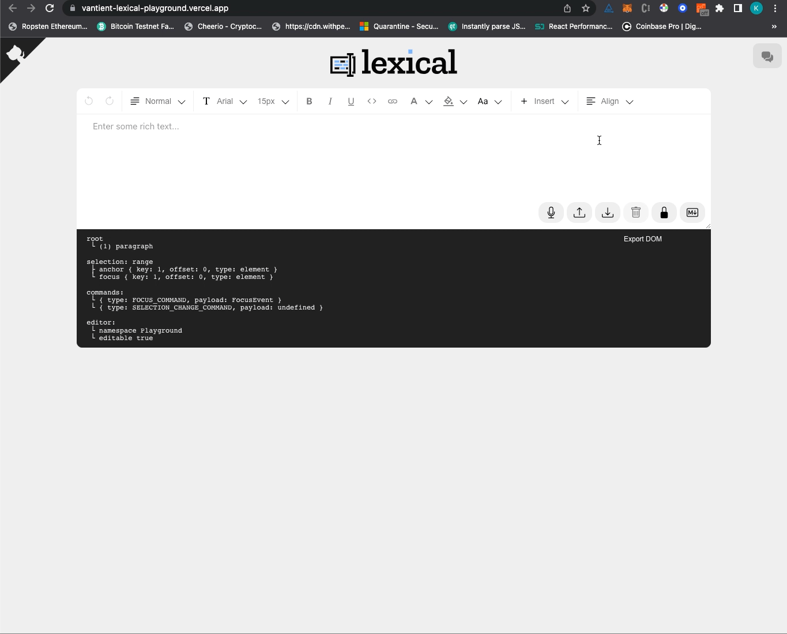

# Lexical Editor with “Vantient Quest Embed” support

## Demo

[Lexical Playground with Quest Embed](https://vantient-lexical-playground.vercel.app/)

### Screen capture



## How to run this project locally?

1. Clone this repository

2. Install dependencies

   - `npm install`

3. Start local server and run tests
   - `npm run dev` to start the dev server.

## Running tests

- `npm run test-unit` runs only unit tests.
- `npm run test-e2e-chromium` runs only chromium e2e tests.
- `npm run debug-test-e2e-chromium` runs only chromium e2e tests in head mode for debugging.
- `npm run test-e2e-firefox` runs only firefox e2e tests.
- `npm run debug-test-e2e-firefox` runs only firefox e2e tests in head mode for debugging.
- `npm run test-e2e-webkit` runs only webkit e2e tests.
- `npm run debug-test-e2e-webkit` runs only webkit e2e tests in head mode for debugging.

## How I added "Vantient Quest Embed" support?

### Step 1: Created `VantientQuestPlugin`

`VantientQuestPlugin` is a Lexical React Plugin that adds a new node type to the editor. 

Since the Plugin introduces new node, it has to be registered in `PlaygroundNodes.ts`

LexicalComposer provides access to the underlying LexicalEditor instance via React Context:

```
// VantientQuestPlugin/index.ts

export default function VantientQuestPlugin(): JSX.Element | null {
  const [editor] = useLexicalComposerContext();
  ...
```

With access to the Editor, the plugin can extend Lexical via [Commands](https://lexical.dev/docs/concepts/commands), [Transforms](https://lexical.dev/docs/concepts/transforms), or other APIs. `VantientQuestPlugin` embeds a `quest` into the editor, by fetching the data asynchronously from `https://cmty.space/quest` based on the provided `questID`:

**Resources**: [Lexical's React plugin](https://lexical.dev/docs/react/create_plugin)

`VantientQuestPlugin` is just a React component that accesses the Lexical editor via React Context (`useLexicalComposerContext`). Using the LexicalEditor instance, this plugin does two things:

- Verifies that there is a `VantientQuestNode` registered on the editor (if you forget to register the node, you can't do #2)
- registers a "command", passing a callback that will run when that command is dispatched. The command callback creates and inserts a `VantientQuestNode` in the editor.

### Step 2: Created `VantientQuestNode`
> Nodes are a core concept in Lexical. Not only do they form the visual editor view, as part of the EditorState, but they also represent the underlying data model for what is stored in the editor at any given time. Lexical has a single core based node, called LexicalNode that is extended internally to create Lexical's five base nodes: RootNode, LineBreakNode, ElementNode, TextNode and DecoratorNode.

For `VantientQuestNode` I have extended `DecoratorNode` since Decorator node rendering can output components from React, vanilla js or other frameworks.

**Overview**:

```
export class VantientQuestNode extends DecoratorBlockNode {
  ...
  decorate(_editor: LexicalEditor, config: EditorConfig): JSX.Element {
    ...
    return (
      <React.Suspense>
        <VantientQuestComponent
          className={className}
          format={this.__format}
          nodeKey={this.getKey()}
          questID={this.__id}
        />
      </React.Suspense>
    );
  }
}
```

- Registered `VantientQuestNode` in `PlaygroundNodes.ts`

**Resources**: [Extending decoratornode](https://lexical.dev/docs/concepts/nodes#extending-decoratornode)

### Step 3: Created VantientQuestComponent

This is a React component that renders the Vantient Quest Embed based on the API response from: `https://cmty.space/api/query/quest` using `questId`

- Note: I have not used `iframe` for rendering the embed since it is on the same domain as the editor. But if we need to embed it as an `iframe`, we can achieve that too.

- Under the `ui` folder, I have added the related styles in `VantientQuestComponent.css` file and also created `VantientButton.tsx`, `VantientButton.css` for rendering the button.

### Step 4: Created VantientQuestEmbedConfig

Added `VantientQuestEmbedConfig` in `AutoEmbedPlugin/index.tsx` file which has all the meta data to be used for `ComponentPickerOption`.

This is used to render the "Vantient Quest" option in the toolbar and then the modal.

Once user enters the URL, the `parseUrl` method is used to check if it is a valid URL: `/^.*(cmty\.space\/quest\/)([a-zA-Z0-9]+).*/.exec(url)` and if it is valid, the embed button is enabled and the user can click on it to embed the quest.

I have also added check to see if the ID length is `32` characters. Embed button will be disabled for other lengths.

On clicking embed, the `VantientQuestPlugin` will trigger the command `INSERT_VANTIENT_QUEST_COMMAND` to insert the `VantientQuestNode` in the editor.

**Resources:** [Commands](https://lexical.dev/docs/concepts/commands)

## Areas for Improvements:

- Right now I am using `LexicalBlockWithAlignableContents` so that `VantientQuestNode` can be deleted. But a better approach would be to create another component which handles `VantientQuestNode` deletion and other future features explicitly.

- Currently the Export DOM feature is only exporting a plain `<div>` with the quest ID. We can improve this by exporting the actual quest embed.

- Add e2e test to check if the quest embed is rendered correctly.

- Better icon for "Vantient Quest" option under "Insert" in the toolbar.

- Focus input field on launching modal for Vantient Quest Embed.